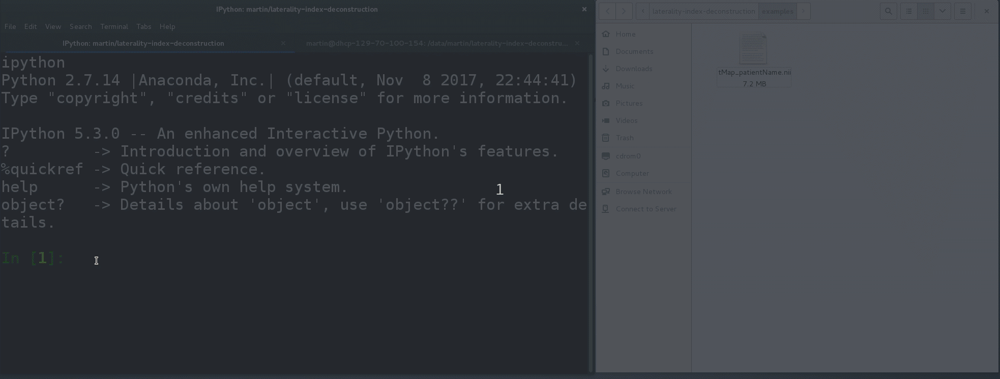

# Quantifying the Confidence in fMRI-based Language Lateralisation through Laterality Index Deconstruction

[](https://github.com/mwegrzyn/laterality-index-deconstruction)
[](https://neurovault.org/collections/3887)

Martin Wegrzyn, Markus Mertens, Christian G. Bien, Friedrich G. Woermann & Kirsten Labudda


*This animated gif shows the usage of the tool in real time.*

### Abstract

In epilepsy patients, language lateralisation is an important part of the presurgical diagnostic process. Using task-based fMRI, language lateralisation can be determined by visual inspection of activity patterns or by quantifying the difference in left- and right-hemisphere activity using variations of a basic formula [(L-R)/(L+R)]. However, the values of this laterality index (LI) depend on the choice of activity thresholds and regions of interest. The diagnostic utility of the LI also depends on how its continuous values are translated into categorical decisions about a patient’s language lateralisation.  
Here, we analysed fMRI data from 712 epilepsy patients who performed a verbal fluency task. Each fMRI data set was evaluated by a trained human rater as depicting left-sided, right-sided, or bilateral lateralisation or as being inconclusive. We used data-driven methods to define the activity thresholds and regions of interest used for LI computation and to define a classification scheme that allowed us to translate the LI values into categorical decisions. By deconstructing the LI into measures of laterality (L-R) and strength (L+R), we also modelled the relationship between activation strength and conclusiveness of a data set.  
In a held-out data set, predictions reached 91% correct when using only conclusive data and 82% when inconclusive data were included. Although only trained on human evaluations of fMRIs, the approach generalised to the prediction of language Wada test results, allowing for significant above-chance accuracies. Compared against different existing methods of LI-computation, our approach improved the identification of inconclusive cases and increased the accuracy with which decisions for the remaining data could be made.  
We discuss how this approach can support clinicians in assessing fMRI data on a single-case level, deciding whether lateralisation can be determined with sufficient certainty or whether additional information is needed.  

### Project Organization

```
├── README.md           <- The top-level README for developers using this project.
│
├── LICENSE             <- Code is distributed under the MIT License.
│
├── data		(not part of the repo)
│   ├── external        <- Data from third party sources (e.g. MNI templates).
│   ├── raw             <- The original, immutable data.
│   ├── interim         <- Intermediate data that has been transformed.
│   └── processed       <- The final features and predictions.
│
├── notebooks           <- Jupyter notebooks. Naming convention is a number (for ordering),
│                          the creator's initials, and a short `-` delimited description, e.g.
│                          `01-mw-train-test-split`.
│
├── models              <- Transformations applied to training data
│                          and predictive models derived from training.
│
├── reports             <- Final results of the analyses.
│   └── figures         <- Generated figures used in the manuscript and this readme.
│   └── nii             <- fMRI group results in normalized MNI space.
│
├── ms                  <- The preprint of the article as a LaTeX document.
│
├── helper              <- Scripts which help to convert notebooks into .py files, etc.
│
├── temp                <- Data which are only needed temporarily are stored here.
│
├── src                 <- Source code for use in this project.
│   │
│   ├── __init__.py     <- Makes src a Python module.
│   │
│   ├── make_predict.py <- Allows to run a complete analysis for one dataset.
│   │
│   ├── data            <- Scripts to generate interim data.
│   │   └── make_dataset.py
│   │
│   ├── features        <- Scripts to turn interim data into features for modeling.
│   │   └── build_features.py
│   │
│   ├── models          <- Scripts to use trained models to make predictions.
│   │   └── predict_model.py
│   │
│   └── visualization   <- Scripts to create result visualizations.
│       └── visualize.py
│
├── examples            <- example outputs of running the toolbox.
│
├── requirements.txt    <- The requirements file for reproducing the analysis environment,
│                          generated with `pip freeze > requirements.txt`
│
└── env                 <- The analysis environment, generated with
                           `virtualenv env && env/bin/pip install -r requirements.txt`
```
<p><small>Project structure based on the <a target="_blank" href="https://drivendata.github.io/cookiecutter-data-science/">cookiecutter data science project template</a>. #cookiecutterdatascience</small></p>

### Requirements

Data analysis was performed on Debian 8.11 with Python 2.7 using mainly numpy, scipy, pandas, scikit-learn, nilearn, matplotlib, seaborn and jupyter.

To run all the scipts, you can create a virtual environment, by first installing virtualenv


  ```shell
  pip install virtualenv
  ```

Then you can create a virtual environment in the folder into which you cloned this repository

  ```shell
  virtualenv env
  ```

and then install all modules using pip and the requirements file provided in this repository


  ```shell
  env/bin/pip install -r requirements.txt
  ```

### Contact

For questions or comments please write to [martin.wegrzyn@uni-bielefeld.de](mailto:martin.wegrzyn@uni-bielefeld.de)

